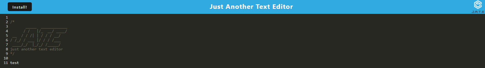
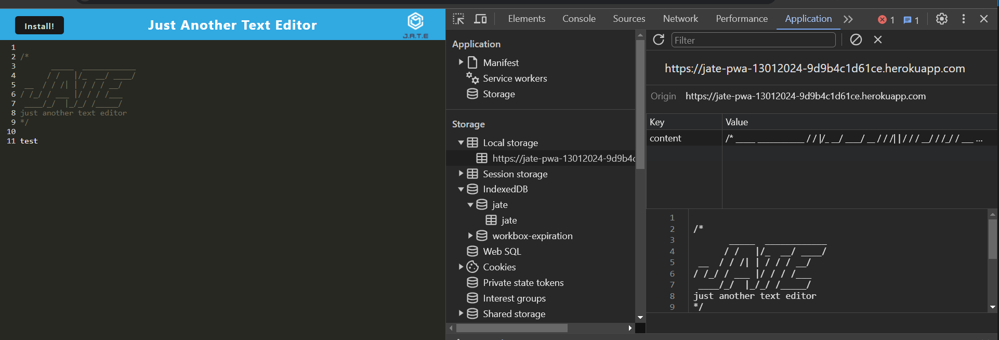
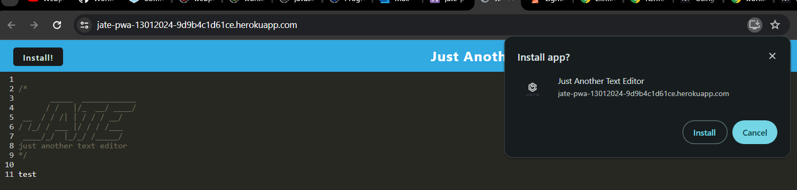

# Text-Editor-PWA

## Description
    
A text editor webpage built using PWA concepts.
    
## Table of Contents
    
- [Installation](#installation)
- [Usage](#usage)
- [Credits](#credits)
- [License](#license)
- [How to Contribute](#how-to-contribute)
- [Tests](#tests)
    
## Installation
    
Open url link https://jate-pwa-13012024-9d9b4c1d61ce.herokuapp.com/ in a browser such as Google Chrome, Firefox or Edge etc.

## Usage

You can write and save notes in the text editor.

 

Your note is automatically saved in local storage and indexDB storage when you navigate away from the text editor.

 

You can click on the Install button or the Computer icon in the browser's address bar to install the text editor as progress web app on your device.

 

    
## Credits
NA

## License
 
This project is licensed under the MIT License - see the [LICENSE.md](license) file for details    
 
## How to Contribute
    
Feel free to contribute your ideas or bug fixes for this project by raising a new issue or new pull request.
    
## Tests
NA
